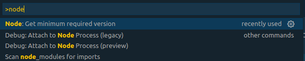
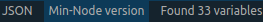
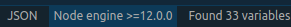
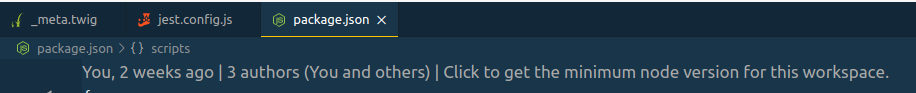

# VSCode Min-Node

## Idea

NPM already provides a possibility for package authors to specify which Node versions their package can be used with, namely the [engines](https://docs.npmjs.com/files/package.json#engines) field in the package.json file.

## Motivation

You have an existing project which is in need of bumping many dependencies to newer versions? Your project is based on an [outdated Node version](https://nodejs.org/en/about/releases/)?

**How do you know which is the minium required Node version your project needs after bumping all your dependencies to be up-to-date again?**

Trial and error? Manually checking all dependencies what they have stated as node engine in their package.json?

Both are _frustrating_ and _take_ you _a lot of time_. **This extension is doing this work for you!**

## Disclaimer

**This extension WILL NOT PROVIDE and CAN NOT GUARANTEE you a 100% accurate answer to this question.**

Why not? Well, we do not live in a perfect world and thus there are certain factors and assumptions that influence the quality of the result.

### Assumption: Node range specified on a dependency fulfills the Node ranges of all its own dependencies

Example: Your project has package "foo" as a dependency. "foo" itself has a dependency on its own called "bar".

To simplify the logic here we assume that the minimum node version that "foo" requires also matches the Node range specified on "bar" and any other dependency "foo" might have besides "bar".

With this assumption it is "enough" to check the direct dependencies of your project instead of checking the whole dependency tree.

### Factor package.json Quality: What about packages that do not provide the `engines` field in their package.json?

Short answer: We ignore those packages for now, but still they all might have hidden Node dependencies which are not taken into account at all.

You will just find them while trying it out.

## Tl;dr

Don't take the results too seriously. The extension is meant to be used for getting a broad idea which Node version might be required to fit all dependencies.

The result you get back is baked under all those assumptions and factors explained above.

But one thing is for sure: The exact specified minimum node version you need is not less than what we gave you as an orientation. It can just be higher as that one.

## Requirements

Your workspace needs to have a package.json file with the correct dependencies being installed in the node_modules folder.

## Dependencies

The _main_ dependency of this extension is the underlying business logic encapsulated in the [min-node NPM package](https://www.npmjs.com/package/min-node).

## Features

### Commands

#### Calculate

This command is the _main_ command being used to get the minimum required node version based on your dependencies.

When you execute it, you will see some notification popping up showing you the calculated minimum node version.

### Status bar

The extension also provides access to the calcuate command via the status bar. You don't have to use it, it is basically just another location in VSCode to access the same functionality.

Unless you click the status bar item once, it will stay "inactive" like this:

As soon as you click it, it will calculate the minimum node version and will show it in the status bar like in the following example:

### Code Lense on package.json files

Another way to access the exntension's functionality is via a so called [editor code lense](https://vscode.rocks/codelens/) on the first line of the package.json.

Clicking it will have the same effect as executing the command directly, thus will show you a popup with the minimum node version inside.
